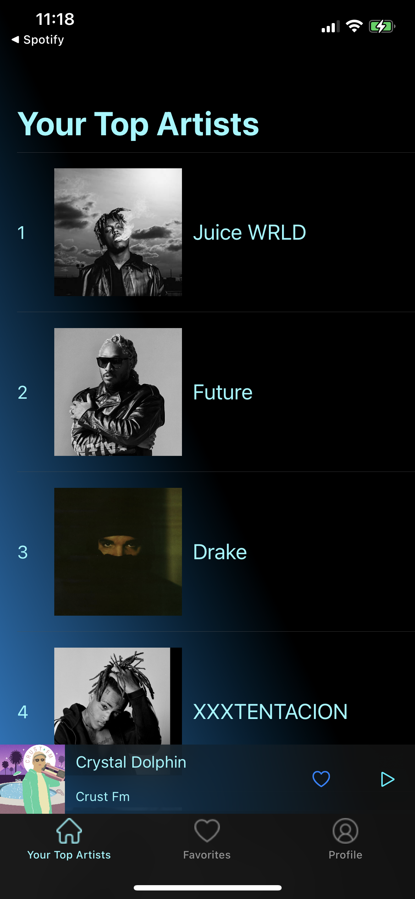
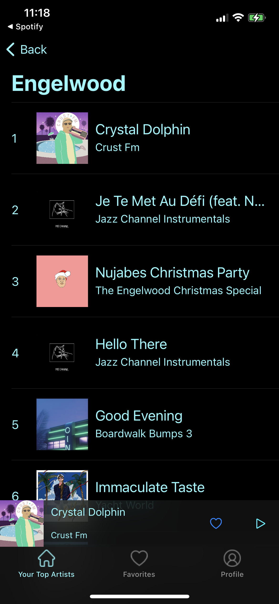
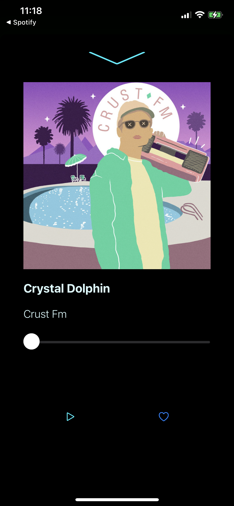

# Discount Spotify
An iOS app that authenticates users through Spotify iOS SDK, makes network calls to show the user’s top artists, their top 10 tracks and a 30 second preview, and an option to save tracks at to the user's liked songs
## Demo
### Authentication

### Top Artists & Their Top Tracks
   
### User's Liked Songs & Profile
 
## How It Works
* Users authenticate with their Spotify account so the network calls can be made to pull the proper data
* Network calls are made by Spartan's functions
* The HomeController will have a tableview populated by the user's top artists according to Spotify
* Users can browse the artists' top 10 tracks and play a 30 second preview
* Users can save tracks at the local level using CoreData
## Tools
* Core Data
* [Spotify iOS SDK](https://github.com/spotify/ios-sdk)
* [Spartan](https://github.com/Daltron/Spartan)
* [Kingfisher](https://github.com/onevcat/Kingfisher)
* [Snapkit](https://github.com/SnapKit/SnapKit)
